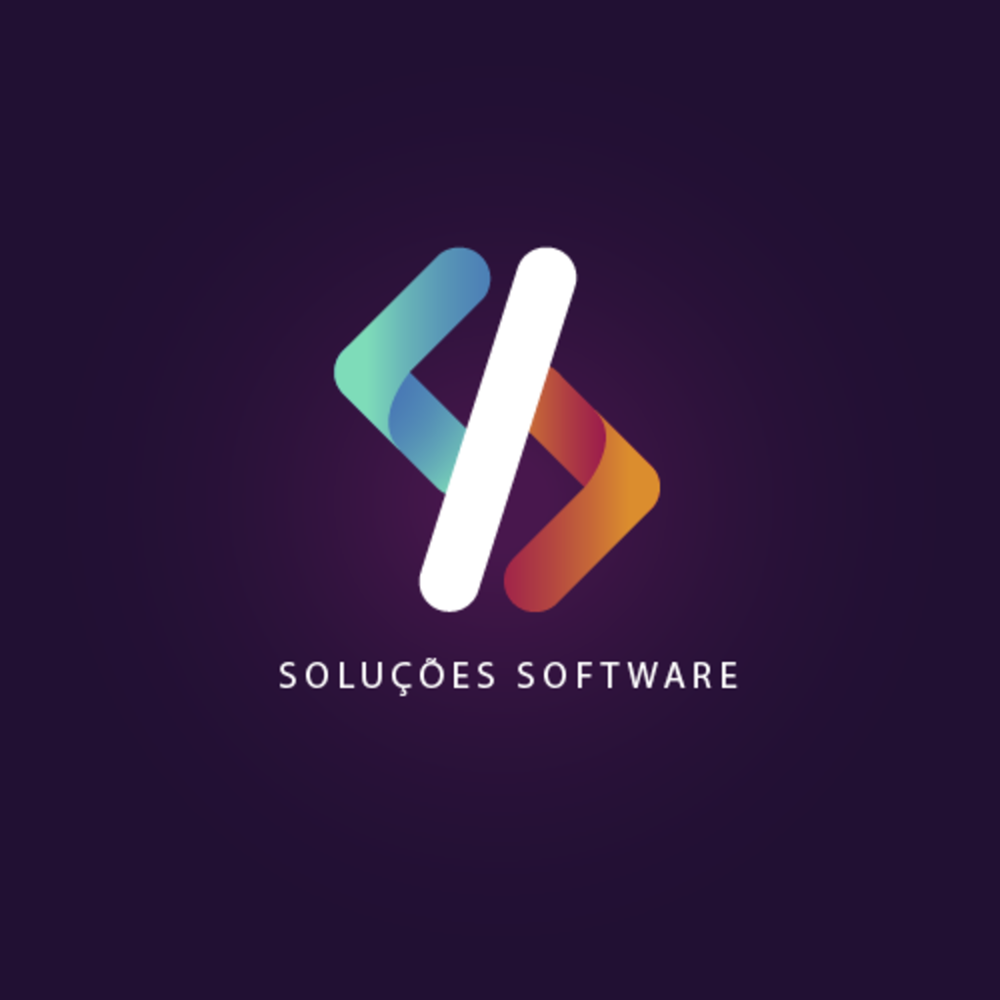

<!--
Readme template -> https://github.com/othneildrew/Best-README-Template
## Guards - Table - Model
    web - user - developer
## Sessões
    client: client,
    login_client: boolean

## Cokkies
-->

<!-- PROJETO LOGO -->
 

  

  <h3 align="center">Soluções Software</h3>

  

    Site de indentidade visual da Soluções Software.
  

<!-- MENU -->

  
MENU

  <ol>
    <li><a href="#tecnologias-utilizadas">Tecnologias Utilizadas</a></li>
    <li></li>
    <li><a href="#versão-atual">Versão atual</a></li>
    <li><a href="#observação">Observação</a></li>
  </ol>

## Tecnologias Utilizadas
1. FRONT-END
    * HTML 5
    * CSS 3
    * BOOTSTRAP ^5.3 (SITE)
    * TAILWIND 3
    * TAILWIND ELEMENTS
    * BLADE
    * JQUERY 3.7 (SITE)
    * LIVEWIRE 3 (ADMIN)
    * ALPINE JS
    * WIRE UI
    * NODE 20.10.0 (LTS)
    * NPM 10.2.3
2. BACK-END
    * PHP 8.2.7
    * LARAVEL 10

(<a href="#readme-top">Voltar ao topo</a>)

<!-- COLABORADORES -->
## Colaboradores
 --- **N/A** ---

(<a href="#readme-top">Voltar ao topo</a>)

## Versão atual
:heavy_check_mark:  ?

(<a href="#readme-top">Voltar ao topo</a>)

### Observação
 <!-- Link da API: https://covid19-brazil-api.vercel.app/ -->

